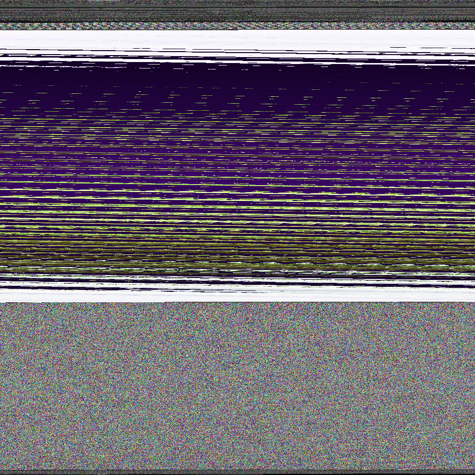

# AnyToImage

This project allows you to convert almost any file, group of files, or directory into an image.
By reading bytes from a file and using those bytes as color channel values, pixels can be constructed and used to form an image.
The current build allows you to convert files to images, and extract files from converted images.
This program is written purely in Java, meaning that it can run on all systems supported by Java. 
There are no additional libraries to configure.

  

The image above is a demonstration of this code. 
It is composed of 27 folders containing a total of 520 files.
Each source file is a representation of "Hello World" in a different programming language.
The files can be obtained from the <a href="https://github.com/leachim6/hello-world">hello-world</a> repository
which was inspired by <a href="https://helloworldcollection.github.io/">The Hello World Collection</a>.

## Prerequisites

### Java
* [Java Downloads](http://www.oracle.com/technetwork/java/javase/downloads/index.html)

## Getting Started

### Installing Java

Installing the Java Development Kit (JDK) is only a requirement for developers. 
Users who plan to solely use the program (run the pre-built JAR file) are only required to install the Java Runtime Environment (JRE). 
The minimum compiler compliance is 1.8, meaning that systems with installations of Java 8 and above can run the JAR. 
Simply install the version of your choice for your operating system, and you can convert almost any file into an image!

## License
This project is licensed under the MIT License - see the [LICENSE.md](LICENSE.md) file for details

## Adaptations
[Web interface](https://img.kyle.tools/) written by [Kyle  Sferrazza](https://github.com/kylesferrazza)
